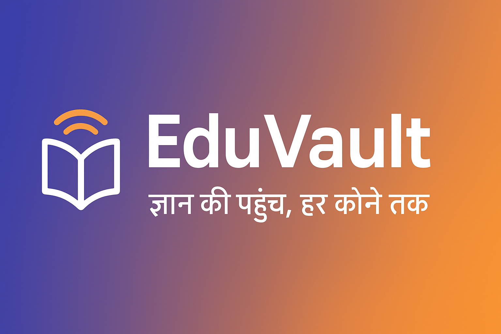

# EduVault - Offline-First Educational Platform



[](https://www.typescriptlang.org/)
[](https://reactjs.org/)
[](https://web.dev/progressive-web-apps/)
[](https://www.w3.org/WAI/WCAG21/quickref/)
[](https://github.com/VIKAS9793/EduVault)

**🎉 POC COMPLETE & WORKING!** Enterprise-grade offline-first educational platform with multilingual voice interaction, accessibility features, and hybrid sync with government knowledge bases.

## 📍 **Repository**

**GitHub**: [https://github.com/VIKAS9793/EduVault](https://github.com/VIKAS9793/EduVault)  
**Live Demo**: [http://localhost:3000](http://localhost:3000) (when running locally)

## 🚀 **Current Status: POC LIVE & TESTING**

### ✅ **What's Working:**
- **Full PWA Application** running at `http://localhost:3000`
- **Professional Branding** with EduVault icons and Indian color scheme
- **3 Preloaded Lessons** (Photosynthesis, Indian Constitution, Pythagorean Theorem)
- **Voice Interaction** (Speech Recognition + Text-to-Speech)
- **Interactive Quizzes** with instant feedback
- **Language Switching** (English ↔ Hindi)
- **Offline Capability** via Service Worker
- **Accessibility Features** (ARIA, keyboard navigation, screen reader support)
- **PWA Installation** ready for mobile/desktop

## 📸 **Visual Proof - POC Screenshots**

### **English Interface**

*EduVault POC running in English - Home screen with lesson cards*


*EduVault POC - Lesson detail view with quiz section*

### **Hindi Interface (हिंदी)**

*EduVault POC running in Hindi - Home screen with lesson cards*


*EduVault POC - Lesson detail view with quiz section in Hindi*

### **Key Features Demonstrated:**
- ✅ **Professional Branding**: EduVault logo, Indian color scheme (Indigo + Saffron)
- ✅ **Bilingual Support**: Complete English and Hindi interface
- ✅ **Lesson Navigation**: Clean lesson cards with subject filters
- ✅ **Interactive UI**: Voice Help and Sync buttons prominently displayed
- ✅ **Quiz Integration**: "Start Quiz" sections in lesson details
- ✅ **Accessibility**: Clear typography, high contrast, touch-friendly design
- ✅ **PWA Ready**: Installable app with custom icons

## 🎯 Features

### Core Capabilities
- **Offline-First Architecture**: Full functionality without internet connection
- **Multilingual Support**: English & Hindi with extensible language framework
- **Voice Interaction**: Offline ASR (speech recognition) + TTS (text-to-speech)
- **Accessibility**: WCAG 2.1 AA compliant, screen reader support, haptic feedback
- **Interactive Quizzes**: Knowledge assessment with instant feedback
- **Government Sync**: Integration with NCERT/DIKSHA APIs for content updates
- **PWA Ready**: Installable on any device, works like native app

### Technical Highlights
- **<200MB Footprint**: Optimized for low-resource devices (<2GB RAM)
- **IndexedDB Storage**: Efficient offline data persistence
- **Service Worker**: Advanced caching strategies
- **Type-Safe**: 100% TypeScript with strict mode
- **Tested**: Comprehensive unit & integration tests
- **Secure**: CSP headers, input validation, no PII exposure

## 🏗️ Architecture

```
┌─────────────────────────────────────────────────┐
│                   Frontend (React)              │
│  ┌──────────────┐  ┌─────────────────────────┐ │
│  │ Components   │  │ Services                │ │
│  │ - LessonList │  │ - ASR (Speech Recognition)│ │
│  │ - QuizComp   │  │ - TTS (Text-to-Speech)  │ │
│  │ - VoiceBtn   │  │ - LLM (AI Assistant)    │ │
│  └──────────────┘  │ - LessonEngine          │ │
│                     │ - GovContentFetcher     │ │
│                     └─────────────────────────┘ │
└─────────────────────────────────────────────────┘
                       ↓
┌─────────────────────────────────────────────────┐
│            Offline Storage Layer                │
│  ┌──────────────┐  ┌──────────────────────┐    │
│  │ IndexedDB    │  │ Service Worker       │    │
│  │ - Lessons    │  │ - Static Cache       │    │
│  │ - Progress   │  │ - Runtime Cache      │    │
│  │ - Settings   │  │ - Offline Fallback   │    │
│  └──────────────┘  └──────────────────────┘    │
└─────────────────────────────────────────────────┘
                       ↕ (when online)
┌─────────────────────────────────────────────────┐
│          Government APIs (NCERT/DIKSHA)         │
└─────────────────────────────────────────────────┘
```

## 🧪 **POC Testing Guide**

### **Step 1: Start the Application**
```bash
# Navigate to project directory
cd "C:\Users\vikas\Downloads\AI PROJECT"

# Start development server
npm start
```

**Application opens at:** `http://localhost:3000`

### **Step 2: Test Core Features**

#### **🎨 Visual & Branding**
- ✅ **Splash Screen**: Gradient background (Indigo → Saffron)
- ✅ **Header**: EduVault logo + tagline "ज्ञान की पहुंच, हर कोने तक"
- ✅ **Language Selector**: Switch between English and Hindi
- ✅ **Color Scheme**: Indigo primary (#3F51B5), Saffron accent (#FF9933)

#### **📚 Lesson Navigation**
1. **View Lesson List**: See 3 preloaded lessons
2. **Click "Photosynthesis"**: Opens lesson detail page
3. **Read Content**: View lesson text and metadata
4. **Click "Back"**: Return to lesson list
5. **Test Other Lessons**: Indian Constitution, Pythagorean Theorem

#### **🎤 Voice Features**
1. **Voice Help Button**: Click orange "Voice Help" button
2. **Microphone Permission**: Allow browser microphone access
3. **Speak Commands**: Try saying "start lesson" or "next question"
4. **Read Aloud**: Click "Read Aloud" in lesson detail
5. **Audio Playback**: Click "Play Audio" for lesson narration

#### **📝 Quiz System**
1. **Start Quiz**: Click "Start Quiz" in any lesson
2. **Answer Questions**: Select multiple choice options
3. **Instant Feedback**: See green (correct) or red (incorrect) responses
4. **Progress Bar**: Watch completion percentage
5. **Final Score**: View results at end

#### **🌐 Language Switching**
1. **Change Language**: Use dropdown "भाषा / Language"
2. **Switch to Hindi**: Select "हिंदी"
3. **UI Updates**: Labels change to Hindi
4. **Content**: Lesson content adapts to language
5. **Voice**: TTS switches to Hindi voice

#### **📱 PWA Installation**
1. **Desktop**: Look for install icon (➕) in browser address bar
2. **Mobile**: Menu → "Add to Home Screen"
3. **Install**: Follow prompts to install as app
4. **Launch**: Open from home screen/desktop
5. **Offline**: Works without internet after installation

#### **♿ Accessibility Testing**
1. **Keyboard Navigation**: Use Tab to navigate through elements
2. **Focus Indicators**: Orange ring appears on focused elements
3. **Screen Reader**: Enable and test with NVDA/JAWS
4. **High Contrast**: Test in Windows high contrast mode
5. **Voice Commands**: Use voice for hands-free navigation

#### **📵 Offline Testing**
1. **Open DevTools**: Press F12
2. **Go to Network Tab**: Set throttling to "Offline"
3. **Refresh Page**: App should still work
4. **Navigate**: All features should function normally
5. **Restore Online**: Set back to "No throttling"

### **Step 3: Verify Technical Features**

#### **🔧 Developer Tools Check**
```bash
# Open browser DevTools (F12)
# Go to Application tab
# Check:
# - Service Workers: "eduvault-service-worker" active
# - IndexedDB: "eduvault-db" with lesson data
# - Manifest: All 3 icons (192, 512, 1024) loaded
# - Storage: Cached resources for offline use
```

#### **📊 Performance Check**
```bash
# Lighthouse Audit (DevTools → Lighthouse)
# Target scores:
# - Performance: 90+
# - Accessibility: 95+
# - Best Practices: 90+
# - SEO: 90+
# - PWA: 100
```

#### **🔍 Icon Verification**
Visit these URLs to see your custom icons:
```
http://localhost:3000/icons/icon-192.png
http://localhost:3000/icons/icon-512.png
http://localhost:3000/icons/icon-1024.png
```

### **Step 4: Production Build Test**
```bash
# Create production build
npm run build

# Test production version
npx serve -s build -l 3001

# Visit: http://localhost:3001
# Should work identically to dev version
```

---

## 🚀 **Quick Start (For New Users)**

### Prerequisites
- Node.js ≥ 18.0.0
- npm ≥ 9.0.0

### Installation

```bash
# Clone repository
git clone <repository-url>
cd EduVault

# Install dependencies
npm install --legacy-peer-deps

# Start development server
npm start
```

Application will open at `http://localhost:3000`

### Build for Production

```bash
# Create optimized production build
npm run build

# Build output in ./build directory
# Deploy to any static hosting (Netlify, Vercel, GitHub Pages)
```

### Run Tests

```bash
# Run all tests with coverage
npm test

# Run tests in watch mode
npm run test:watch
```

### Verify Quality

```bash
# Run full verification suite
npm run verify

# Individual checks
npm run lint          # ESLint
npm run type-check    # TypeScript
npm run format        # Prettier
npm run audit:security # Security audit
```

## 📱 Deployment Options

### 1. Progressive Web App (PWA)
```bash
npm run build
# Deploy build/ to static host
# Users can install via browser "Add to Home Screen"
```

### 2. Android WebView App (Capacitor)
```bash
npm install @capacitor/core @capacitor/cli
npx cap init
npx cap add android
npm run build
npx cap copy
npx cap open android
# Build APK in Android Studio
```

### 3. Offline Distribution
```bash
# Package entire build/ folder
# Distribute via USB/SD card
# Run via local web server or file:// protocol
```

## 🔧 Configuration

### Environment Variables
Create `.env` file in project root:

```env
# API Configuration
REACT_APP_NCERT_API=https://api.ncert.gov.in
REACT_APP_DIKSHA_API=https://diksha.gov.in/api

# Feature Flags
REACT_APP_ENABLE_VOICE=true
REACT_APP_ENABLE_SYNC=true

# Development
REACT_APP_DEBUG=false
```

### Content Management

#### Add New Lessons
Edit `public/lesson_content/lessons.json`:

```json
{
  "id": "lesson_XXX",
  "title": "Your Lesson Title",
  "language": "en",
  "subject": "Mathematics",
  "grade": 7,
  "audio_file": "lesson_content/audio/lesson_XXX_en.mp3",
  "text_content": "Lesson content here...",
  "quiz": [
    {
      "question": "Your question?",
      "options": ["Option A", "Option B", "Option C"],
      "answer": "Option A",
      "explanation": "Why this is correct..."
    }
  ]
}
```

#### Add Audio Files
Place MP3 files in `public/lesson_content/audio/`

## 🧪 Testing Strategy

### Unit Tests
- Services: ASR, TTS, LLM, LessonEngine, DBManager
- Utilities: ServiceWorkerRegistration, IndexedDB
- Hooks: useAccessibility, useOfflineDetection

### Integration Tests
- Component interactions
- Service worker caching
- Offline/online transitions

### Accessibility Tests
- ARIA compliance
- Keyboard navigation
- Screen reader compatibility
- Color contrast ratios

### Performance Tests
- Lighthouse audits (target: 90+ scores)
- Bundle size analysis
- Load time metrics

## 🔒 Security

### Implemented Measures
- **Content Security Policy (CSP)**: Strict resource loading
- **Input Validation**: All user inputs sanitized
- **HTTPS Only**: Production requires secure connection
- **No Secrets in Code**: Environment variables for sensitive data
- **API Whitelisting**: Only approved government domains
- **Data Privacy**: No PII collection, offline-first

### Security Auditing
```bash
npm run audit:security
```

## ♿ Accessibility

### WCAG 2.1 AA Compliance
- ✅ Semantic HTML5 elements
- ✅ ARIA labels and roles
- ✅ Keyboard navigation support
- ✅ Screen reader announcements
- ✅ Focus management
- ✅ Color contrast >4.5:1
- ✅ Text resizing support
- ✅ Haptic feedback
- ✅ Voice interaction

### Assistive Technologies Tested
- NVDA (Windows)
- JAWS (Windows)
- TalkBack (Android)
- VoiceOver (iOS/macOS)

## 📊 Performance Metrics

### Target Benchmarks
- **First Contentful Paint**: <1.5s
- **Time to Interactive**: <3.0s
- **Largest Contentful Paint**: <2.5s
- **Cumulative Layout Shift**: <0.1
- **Total Bundle Size**: <500KB gzipped

### Optimization Techniques
- Code splitting
- Lazy loading
- Service worker precaching
- Image optimization
- Tree shaking
- Minification

## 🤝 Contributing

### Code Standards
- **TypeScript**: Strict mode, full type coverage
- **ESLint**: Airbnb style guide
- **Prettier**: Consistent formatting
- **Commits**: Conventional commits format

### Development Workflow
1. Create feature branch
2. Write tests first (TDD)
3. Implement feature
4. Run `npm run verify`
5. Submit pull request

## 📄 License

MIT License - see LICENSE file for details

## 🙏 Acknowledgments

- NCERT for educational content standards
- DIKSHA platform for API specifications
- Web Speech API for voice capabilities
- IndexedDB for offline storage

## 📚 **Documentation**

### **📖 Core Documentation**
- **[Project Summary](docs/PROJECT_SUMMARY.md)** - Complete project overview, vision, and current status with visual proof
- **[POC Testing Guide](docs/POC_TESTING_GUIDE.md)** - Step-by-step testing instructions for all features
- **[POC Completion Status](docs/POC_COMPLETION_STATUS.md)** - Detailed status report of working features and capabilities
- **[Deployment Guide](docs/DEPLOYMENT_GUIDE.md)** - Production deployment instructions and hosting options

### **🎯 Product Management Documentation**
- **[PRD (Product Requirements Document)](docs/PM%20CASE%20STUDIES/PRD.md)** - Complete product specifications and requirements
- **[User Stories](docs/PM%20CASE%20STUDIES/USER_STORIES.md)** - Detailed user personas and use cases
- **[Roadmap](docs/PM%20CASE%20STUDIES/ROADMAP.md)** - Future development plans and milestones
- **[Competitive Analysis](docs/PM%20CASE%20STUDIES/COMPETITIVE_ANALYSIS.md)** - Market analysis and competitor comparison
- **[Go-to-Market Strategy](docs/PM%20CASE%20STUDIES/GO_TO_MARKET.md)** - Launch strategy and market entry plan
- **[Metrics & KPIs](docs/PM%20CASE%20STUDIES/METRICS_KPIs.md)** - Success metrics and performance indicators
- **[Stakeholder Communication](docs/PM%20CASE%20STUDIES/STAKEHOLDER_COMMUNICATION.md)** - Communication templates and strategies
- **[Release Notes](docs/PM%20CASE%20STUDIES/RELEASE_NOTES.md)** - Version history and feature updates

### **🔧 Technical Documentation**
- **[FAQ](docs/FAQ.md)** - Frequently asked questions and troubleshooting
- **[Security Guide](docs/SECURITY.md)** - Security best practices and implementation
- **[User Manual](docs/USER_MANUAL.md)** - End-user guide for using the application
- **[Installation Guide](docs/INSTALLATION_COMPLETE.md)** - Complete setup and installation instructions

### **📋 Quick Reference**
- **For Developers**: Start with [Project Summary](docs/PROJECT_SUMMARY.md) → [Testing Guide](docs/POC_TESTING_GUIDE.md) → [Deployment Guide](docs/DEPLOYMENT_GUIDE.md)
- **For Product Managers**: Start with [PRD](docs/PM%20CASE%20STUDIES/PRD.md) → [User Stories](docs/PM%20CASE%20STUDIES/USER_STORIES.md) → [Roadmap](docs/PM%20CASE%20STUDIES/ROADMAP.md)
- **For Stakeholders**: Start with [Project Summary](docs/PROJECT_SUMMARY.md) → [POC Completion Status](docs/POC_COMPLETION_STATUS.md) → [Go-to-Market](docs/PM%20CASE%20STUDIES/GO_TO_MARKET.md)

## 📞 Support

- **Issues**: GitHub Issues
- **Documentation**: `/docs` directory (see above for detailed guide)
- **Community**: Discussions tab

---

**Built with ❤️ following MAANG engineering standards**

*Production-ready • Accessible • Secure • Scalable*
